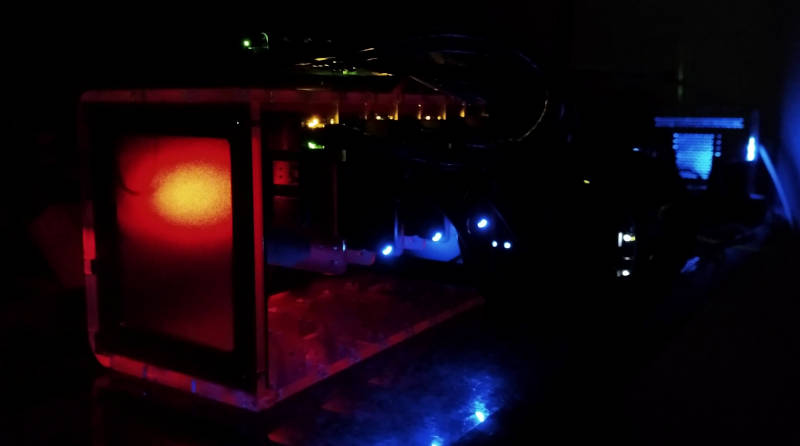

# cluster-pi-kubeadm

Raspberry Pi Kubernetes cluster, provisioned with Ansible + Terraform + Kubeadm, on Ubuntu Server.

## About

I am building a Raspberry Pi cluster at my house. I've been using Kubernetes
professionally for awhile, and I want to learn more about how it works, both
under the hood, and in a bare-metal context.

### Caveat Emptor

There are easier ways to do much of what is discussed here. I avoided the use
of k3s, microk8s, off-the-shelf Ansible modules, and lots of other value-added
things because I wanted to build from scratch. If you choose to follow along,
do so because it's fun, not because this is the recommended approach.

## Goals

My goals for this project are:

- I want to fully capture the deployment with IaC tools.

- I want to maximize security of my home network.

- I want services that are easily available both on and off my home network.

- I want to be able to upgrade / replace things without services going offline.

- I don't want to cause Internet outages for my household.

## Parts List

I tried to use commodity parts as much as possible. I also scrounged from
thing I had lying around, so the actual items for each of these may vary slightly.

### System

I used a C4Labs Cloudlet case. Great airflow, accessibility, and easy to pull
and replace parts without unplugging a lot of stuff.

- 1x [C4Labs 8 Slot Cluster Cloudlet case](https://www.etsy.com/listing/601443602/c4labs-8-slot-cluster-cloudlet-stackable)

- 4x [Raspberry Pi 4 Model B, 8G RAM](https://www.raspberrypi.com/products/raspberry-pi-4-model-b/), 1 control plane node\*, 3 worker nodes

- 1x [Raspberry Pi heat sink kit](https://www.amazon.com/Aluminum-Heatsinks-Conductive-Raspberry-Transistor/dp/B084F9P7XF)

- 4x [Samsung 128G MicroSD card, UHS-I U3 100MB/s](https://www.amazon.com/SAMSUNG-Select-microSDXC-Adapter-MB-ME128HA/dp/B0887GP791)

\*My actually control plane node is a 4G Pi, because I had one on hand.

### Power

I initially had a 2.5 USB hub, not realizing how much power Raspberry Pis
actually consume.

After frying the power supply for that hub, I upgraded to a 12A charger hub.

- 1x [slitinto 60W 12A 8 Port USB Hub Charger](https://www.amazon.com/slitinto-Charging-Certified-Compatible-Bluetooth/dp/B08HN6JK7N)

- 4x [USB A to USB C cable, 1ft](https://www.amazon.com/Durable-Charging-Station-Compatible-Samsung/dp/B08PXWYKTB)

### Network

- 1x [Ubiquiti EdgeRouter 6P](https://www.amazon.com/Ubiquiti-EdgeRouter-6-Port-Gigabit-ER-6P-US/dp/B07BMJ91Q8)

- 1x [TP-Link 5 Port Gigabit Unmanaged Switch](https://www.amazon.com/Ethernet-Splitter-Optimization-Unmanaged-TL-SG105/dp/B00A128S24)

- 4x [Gigabit Ethernet cable, 1ft](https://www.amazon.com/CableCreation-5-Pack-Ethernet-Computer-Network/dp/B01JO3DGAO)

### Storage

- 3x [Samsung EVO 2.5" SSD hard drive](https://www.amazon.com/Samsung-500GB-Internal-MZ-76E500B-AM/dp/B0781Z7Y3S)

- 3x [USB 3.0 to SATA hard drive adapter](https://www.amazon.com/Sabrent-2-5-Inch-Adapter-Optimized-EC-SSHD/dp/B011M8YACM)

## License

The contents of this repository are available under a GPLv3 license. See [LICENSE](LICENSE) for more information.
